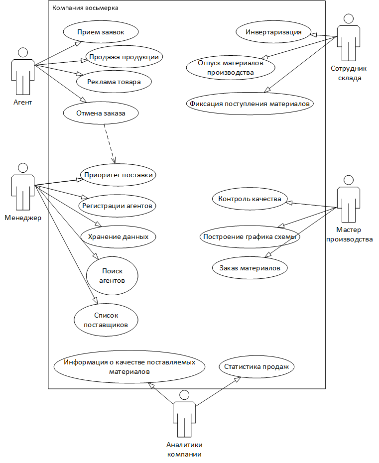

# SQL Запросы 

## Заполнение таблицы productType:

```sql
USE [mbatanov]
GO

INSERT INTO [dbo].[ProductType]
           ([Title], [DefectedPercent])
SELECT 
 	distinct [Тип продукции], 0  
FROM [dbo].[products_k_import]
```

## Заполнение таблицы продукты:

```sql
USE [mbatanov]
GO
INSERT INTO [dbo].[Product]
           ([Title] ,[ProductTypeID],[ArticleNumber],[Image],[ProductionPersonCount],[ProductionWorkshopNumber],[MinCostForAgent])
SELECT 
 [Наименование продукции],pt.ID,[Артикул],[Изображение],[Количество человек для производства],[Номер цеха для производства],[Минимальная стоимость для агента]
 FROM [dbo].[products_k_import] ki, ProductType pt
 where ki.[Тип продукции]=pt.Title
 ```
  
## 3аполнение таблицы materialType:

```sql
USE [mbatanov]
GO
INSERT INTO [dbo].[MaterialType]
	([Title],[DefectedPercent]) 
SELECT
     	distinct [ Тип материала],0
     
FROM [dbo].[materials_short_k_import]
```

## 3аполнение таблицы material:  

```sql
USE [mbatanov]
GO
INSERT INTO [dbo].[Material]
           ([Title],[CountInPack],[Unit],[CountInStock],[MinCount],[Cost],[MaterialTypeID])
SELECT 
	[Наименование материала]  ,[ Количество в упаковке],[ Единица измерения],[ Количество на складе],[ Минимальный возможный остаток],[ Стоимость],mt.ID
FROM [dbo].[materials_short_k_import]mi,MaterialType mt
where mi.[ Тип материала]=mt.Title
```


## 3аполнение таблицы productmaterial:  

```sql
USE [mbatanov]
GO

INSERT INTO [dbo].[ProductMaterial]
           ([ProductID],[MaterialID],[Count])
SELECT 
	p.ID,m.ID,l.[Необходимое количество материала] 
FROM [dbo].[Product] p,Material m, productmaterial_k_import l
where p.Title=l.Продукция and m.[Title]=l.[Наименование материала]
```
# Диаграмма UseCase 


		
# UML. Спецификация вариантов использования (прецедентов)

&nbsp; | &nbsp;
-|------ 
Прецедент |  Продажа продукции
Идентификатор | ID 1
Краткое описание | Агент выбирает продукцию и продает её
Главные акторы | Агент
Второстепенные акторы | Менеджер
Предусловия | Агент выбрал товар
Основной поток | 1. Прецедент начинается, когда Агент оформляет заказ<br/>2. Менеджер принимает заказ
Альтернативные потоки | 1.1 Агент оформляет заказ 1.2 Менеджер предлагает дополнительные товары
Постусловия | 1. Агент оставил заказ 2. Агент Отказался от покупки

&nbsp; | &nbsp;
-|------ 
Прецедент |  Хранение данных об агентах
Идентификатор | ID 6
Краткое описание | Хранение данных об агентах
Главные акторы | Менеджер
Второстепенные акторы | Агент
Предусловия | Агент выбрал товар
Основной поток | 1. Прецедент начинается, когда Агент оформляет заказ<br/>2. Менеджер записывает агента в базу данных
Альтернативные потоки | 1. Агент заказывает товар не в первый раз 1.1 Менеджер предлагает товары опирируясь на предыдущие заказы<br/>2.1 Агент заказывает товар впервые 2.2 Менеджер показывает полный список товаров
Постусловия | 1. Агент оставил заказ 2. Агент Отказался от покупки

&nbsp; | &nbsp;
-|------ 
Прецедент |  Инветаризация
Идентификатор | ID 16
Краткое описание | Хранение данных об агентах
Главные акторы | Сотрудник склада
Второстепенные акторы | Менеджер
Предусловия | Поступление товаров
Основной поток | 1. Прецедент начинается, когда Сотрудник склада оформляет отправку заказ<br/>2. Сотрудник склада вычитает товар из количество всего товара
Альтернативные потоки | нет
Постусловия |  1 Сотрудник склада заказывает производства отсутствующего товара<br/>2. Создает список товара в наличии
